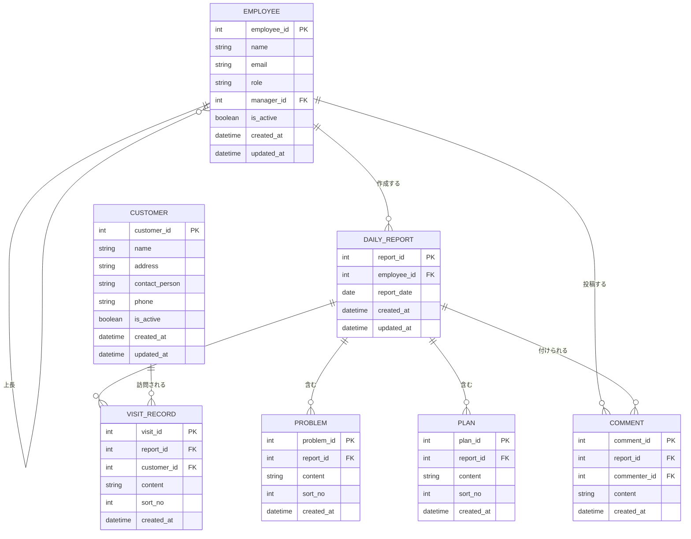

# 営業日報システム 要件定義書

## 1. システム概要

営業担当者が日々の訪問活動を報告し、上長がそれに対してコメント（指導・フィードバック）を行うための日報管理システム。

## 2. 利用者・ロール

| ロール | 説明 |
|---|---|
| 営業担当者 | 日報の作成・編集を行う。自分の日報と、上長からのコメントを閲覧する。 |
| 上長 | 部下（直属の営業担当者）の日報を閲覧し、コメントを付ける。 |
| 管理者 | 営業マスタ・顧客マスタの管理を行う。 |

※ 営業担当者ごとに直属の上長を1人設定する（組織階層はシンプルな1対1の上司関係とする）。

## 3. 機能要件

### 3.1 日報管理
- 営業担当者は1日につき1件の日報を作成する（営業担当者×日付でユニーク）。
- 日報は下書き保存・編集が可能。
- 承認フロー・ステータス管理は行わない（上長コメントの有無のみで確認状況を判断する）。

### 3.2 訪問記録
- 日報には、その日に訪問した顧客と訪問内容を複数行登録できる（同一顧客への複数回訪問も可）。
- 各訪問記録には、顧客（顧客マスタ参照）、訪問内容、表示順を持たせる。

### 3.3 課題・相談（Problem）
- 日報には、現在の課題や相談事項を複数項目、明細形式で登録できる。

### 3.4 明日の予定（Plan）
- 日報には、翌日の予定を複数項目、明細形式で登録できる。

### 3.5 上長コメント
- 上長は部下の日報1件に対して、コメントを投稿できる（日報全体に対する1つのコメントスレッド）。
- 1件の日報に対して複数回・複数コメントの投稿が可能（やり取りの履歴として蓄積）。

### 3.6 顧客マスタ
- 顧客の基本情報（顧客名、住所、担当者名など）を管理する。
- 訪問記録から参照される。

### 3.7 営業マスタ
- 営業担当者の基本情報（氏名、メールアドレス、直属の上長）を管理する。
- ログイン・認証の主体としても利用する。

## 4. 非機能要件（概要）

- 個人情報（氏名・メール・住所等）を扱うため、アクセス制御（自分および自部下の日報のみ閲覧可能）を実装する。
- 入力値のバリデーション、SQLインジェクション対策など基本的なセキュリティ要件を満たす。

## 5. ER図

## 6. テーブル補足

- `DAILY_REPORT`: `employee_id` + `report_date` にユニーク制約を設け、1営業担当者につき1日1件を担保する。
- `VISIT_RECORD` / `PROBLEM` / `PLAN`: いずれも `report_id` に紐づく明細テーブル。`sort_no` で表示順を管理する。
- `COMMENT`: `report_id` に紐づき、`commenter_id`（上長）を参照する。1件の日報に複数コメントを許容する。
- `EMPLOYEE.manager_id`: 自己参照FK。直属の上長を1人示す（NULL可＝最上位役職者）。

## 7. 未確定事項（今後の確認ポイント）

- 認証方式（社内SSO連携の要否など）
- 顧客マスタ・営業マスタの詳細項目（業界、担当エリアなど）
- 訪問記録に訪問日時・訪問方法（対面/電話/オンライン）などの項目が必要か
- 日報の一覧検索・集計機能（月次サマリなど）の要否

## 8. 関連ドキュメント

### 1. 画面設計
- 画面定義書：[docs/screen-definition.md](docs/screen-definition.md)
@docs/screen-definition.md

### 2. API仕様書
- API仕様書：[docs/api-specification.md](docs/api-specification.md)
@docs/api-specification.md

### 3. テスト仕様書
- テスト仕様書：[docs/test-specification.md](docs/test-specification.md)
@docs/test-specification.md

## 使用技術
**言語:** TypeScript  
**フレームワーク** Next.js(App Router)  
**UIコンポーネント** shadcn/ui + Tailwind CSS  
APIスキーマ定義** OpenAPI(Zodによる検証)  
**DBスキーマ定義** Prisma.js  
**テスト** Vitest  
**デプロイ** Google Cloud Run  
