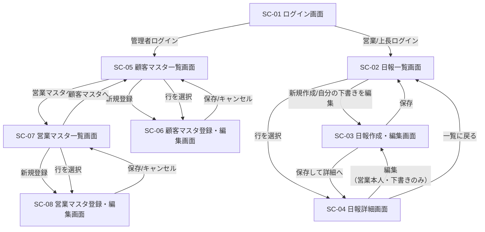

# 営業日報システム 画面定義書

## 1. 画面一覧

| 画面ID | 画面名 | 概要 | 利用ロール |
|---|---|---|---|
| SC-01 | ログイン画面 | 認証を行う | 全ロール |
| SC-02 | 日報一覧画面 | 日報の一覧を表示する（営業は自分の分、上長は部下の分も） | 営業担当者・上長 |
| SC-03 | 日報作成・編集画面 | 訪問記録・課題・予定を入力する | 営業担当者 |
| SC-04 | 日報詳細画面 | 日報内容を閲覧し、上長がコメントを投稿する | 営業担当者・上長 |
| SC-05 | 顧客マスタ一覧画面 | 顧客マスタの一覧・検索を行う | 管理者 |
| SC-06 | 顧客マスタ登録・編集画面 | 顧客情報を登録・編集する | 管理者 |
| SC-07 | 営業マスタ一覧画面 | 営業担当者マスタの一覧・検索を行う | 管理者 |
| SC-08 | 営業マスタ登録・編集画面 | 営業担当者情報（上長設定含む）を登録・編集する | 管理者 |

## 2. 画面遷移図

## 3. 画面詳細

### SC-01 ログイン画面

| 項目 | 内容 |
|---|---|
| 目的 | ユーザー認証を行い、ロールに応じた画面へ遷移する |
| 表示項目 | メールアドレス入力欄、パスワード入力欄、ログインボタン |
| バリデーション | 未入力チェック、認証失敗時はエラーメッセージ表示 |
| 遷移先 | 営業担当者・上長 → SC-02／管理者 → SC-05 |

### SC-02 日報一覧画面

| 項目 | 内容 |
|---|---|
| 目的 | 日報の一覧を確認し、作成・詳細画面へ遷移する |
| 表示項目 | 日付、営業担当者名（上長ログイン時のみ）、訪問件数、コメント有無、未読コメントバッジ |
| 検索・絞込 | 期間指定、営業担当者選択（上長のみ）、コメント有無での絞込 |
| アクション | 「新規作成」ボタン（営業担当者のみ、当日分の下書きがない場合）、一覧行クリックで詳細表示 |
| 権限制御 | 営業担当者は自分が作成した日報のみ表示。上長は自分の部下（`manager_id`が自分）の日報のみ表示 |
| 遷移先 | SC-03（新規作成）、SC-04（行選択） |

### SC-03 日報作成・編集画面

| 項目 | 内容 |
|---|---|
| 目的 | 日報本体・訪問記録・課題（Problem）・予定（Plan）を入力する |
| 表示項目（ヘッダ） | 対象日（当日固定、変更不可）、営業担当者名（ログインユーザー） |
| 入力項目（訪問記録・明細） | 顧客（顧客マスタからの選択式）、訪問内容（テキスト）、行の追加・削除・並び替え |
| 入力項目（Problem・明細） | 課題・相談内容（テキスト）、行の追加・削除・並び替え |
| 入力項目（Plan・明細） | 明日の予定内容（テキスト）、行の追加・削除・並び替え |
| バリデーション | 訪問記録は顧客未選択で保存不可、各明細のテキストは必須かつ文字数上限あり |
| アクション | 「一時保存」「保存」ボタン |
| 権限制御 | 本人が作成した日報のみ編集可能。他人の日報は編集不可 |
| 遷移先 | 保存後 SC-02 または SC-04 |

### SC-04 日報詳細画面

| 項目 | 内容 |
|---|---|
| 目的 | 日報内容を閲覧し、上長がコメントを投稿する |
| 表示項目 | 対象日、営業担当者名、訪問記録一覧（顧客名・訪問内容）、Problem一覧、Plan一覧 |
| コメント欄 | 既存コメントの一覧（投稿者名・投稿日時・本文）を時系列表示、コメント入力欄、「投稿」ボタン |
| アクション | 上長：コメント投稿。営業本人：内容編集へのリンク（SC-03へ遷移） |
| 権限制御 | コメント投稿は当該営業担当者の直属の上長のみ可能 |
| 遷移先 | SC-02（一覧に戻る）、SC-03（編集） |

### SC-05 顧客マスタ一覧画面

| 項目 | 内容 |
|---|---|
| 目的 | 顧客マスタの一覧表示・検索 |
| 表示項目 | 顧客名、住所、担当者名、電話番号、有効/無効状態 |
| 検索・絞込 | 顧客名でのキーワード検索、有効/無効での絞込 |
| アクション | 「新規登録」ボタン、行選択で編集画面へ |
| 遷移先 | SC-06 |

### SC-06 顧客マスタ登録・編集画面

| 項目 | 内容 |
|---|---|
| 目的 | 顧客情報の登録・編集 |
| 入力項目 | 顧客名（必須）、住所、担当者名、電話番号、有効/無効フラグ |
| バリデーション | 顧客名は必須・重複チェック、電話番号は形式チェック |
| アクション | 「保存」「キャンセル」ボタン |
| 遷移先 | 保存/キャンセル後 SC-05 |

### SC-07 営業マスタ一覧画面

| 項目 | 内容 |
|---|---|
| 目的 | 営業担当者マスタの一覧表示・検索 |
| 表示項目 | 氏名、メールアドレス、ロール、直属の上長名、有効/無効状態 |
| 検索・絞込 | 氏名でのキーワード検索、上長での絞込 |
| アクション | 「新規登録」ボタン、行選択で編集画面へ |
| 遷移先 | SC-08 |

### SC-08 営業マスタ登録・編集画面

| 項目 | 内容 |
|---|---|
| 目的 | 営業担当者情報の登録・編集（直属の上長設定を含む） |
| 入力項目 | 氏名（必須）、メールアドレス（必須・一意）、ロール（営業/上長/管理者）、直属の上長（選択式、自分自身は選択不可）、有効/無効フラグ |
| バリデーション | メールアドレス形式・重複チェック、上長の循環参照防止（自分の部下を自分の上長に設定できない） |
| アクション | 「保存」「キャンセル」ボタン |
| 遷移先 | 保存/キャンセル後 SC-07 |

## 4. 未確定事項（今後の確認ポイント）

- 日報一覧・詳細画面での未読コメントの通知方法（バッジ表示の要否、メール通知など）
- 日報作成画面での顧客選択方法（プルダウン／検索モーダルなど、顧客数が多い場合のUI）
- レスポンシブ対応・モバイル利用の要否（外出先での入力を想定するか）
- 一覧画面でのページング・表示件数
